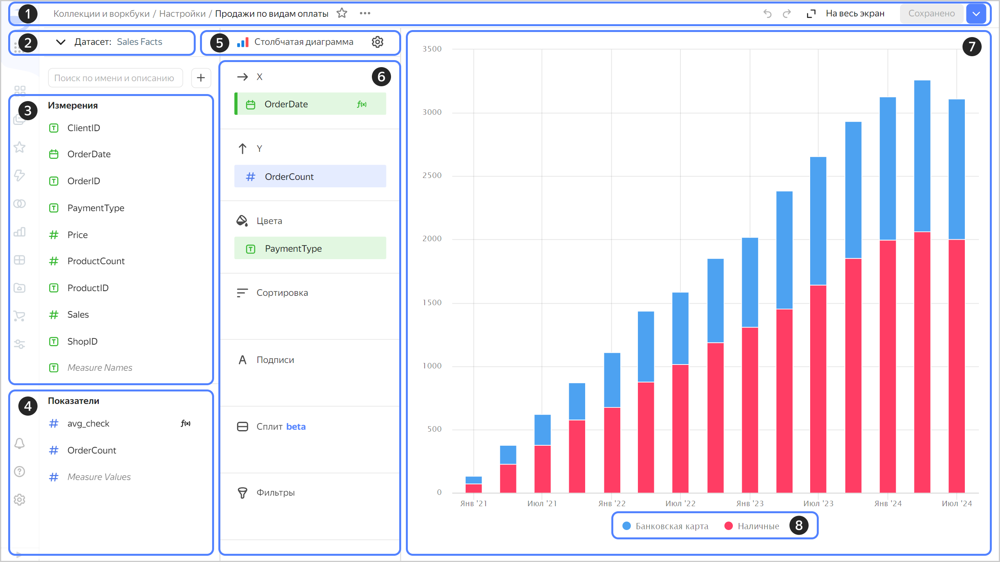

# Чарты в визарде

Визард — это конструктор, в котором можно создавать чарты на основе данных из одного или нескольких датасетов (см. [{#T}](./multidataset-chart.md)). Вы можете создать неограниченное количество чартов на базе одного датасета.



Чарт позволяет провести быстрый анализ и проверить гипотезу. Также чарты можно сохранять и добавлять на дашборды в виде виджетов.



В {{ datalens-short-name }} существуют ограничения на количество строк данных, которое могут отобразить чарты. Ознакомьтесь с ними в разделе [{#T}](../limits.md).



Интерфейс визарда включает следующие элементы:

1. Вверху располагается общая информация: путь до чарта, а также элементы управления и сохранения, общие для всех чартов.
1. Ниже можно выбрать [датасет](../../dataset/index.md) для построения чарта. После выбора датасета под ним появится список [полей](../../dataset/data-model.md#field), которые доступны для использования в чарте.
1. Измерения датасета, которые можно использовать для построения чарта. Вы можете добавить в список [вычисляемое поле](../calculations/index.md).
1. Показатели датасета, которые можно использовать для построения чарта.
1. Кнопка выбора [типа чарта](../../visualization-ref/index.md) и значок  для открытия [общих настроек](./settings.md#common-settings).
1. Список секций, состав которого зависит от выбранного типа чарта (например, ось X, ось Y, фильтры и т. д.). В секции можно перетаскивать поля.
1. Область предпросмотра, где отображается визуализация.
1. Легенда чарта. Легенда сопоставляет цвета чарта со значениями поля в секции **Цвета**. Нажимая отдельные элементы легенды, можно управлять отображением данных на диаграмме. Можно выбрать несколько элементов легенды с зажатой клавишей `Ctrl`/`Cmd`. Легенда включается и отключается в [настройках чарта](./settings.md).

